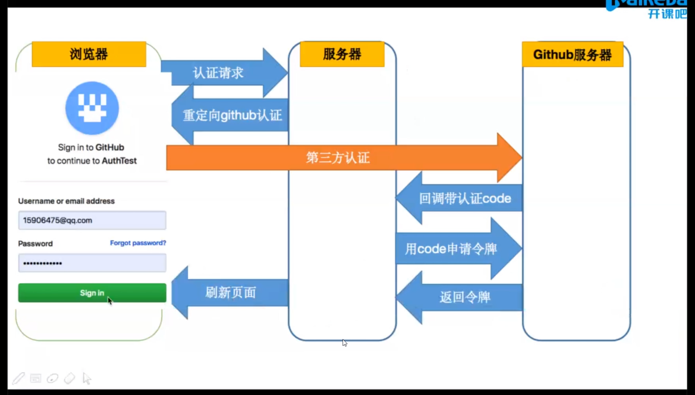
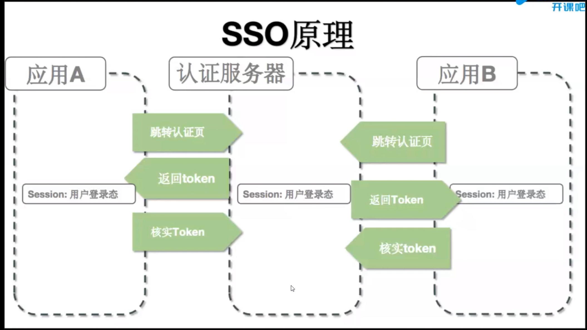

# 鉴权 Authentication

authentication: 鉴权，识别一个用户、设备的身份，用于登陆场景。
authorization: 授权，分配权限，设置用户能否访问哪些资源。

三种常见的鉴权方式：

- Session/Cookie
- Token
- OAuth 第三方认证
- SSO

## session-cookie 方式

session基于cookie实现，cookie是一种协议，当浏览器在A域名下有一个cookie，只要是A域名的请求，都会在header中带上这个cookie，服务端从`req.headers.cookie`中获得cookie，使用`res.setHeader('Set-Cookie', 'cookie1=abc;')`设置cookie。

纯粹的 cookie 机制不会用于鉴权，因为可存的东西少，并且存在浏览器端的值容易被修改。基于 cookie 可实现 sesison，cookie 只存 sid。

session 是个保存在服务端的对象，里面存用户登陆相关的信息。

session 基本实现见 './cookie.js';

在 session 基本实现中，将session保存到代码里(即内存中)，这种方式一会占用很多服务器内存(如万人在线)，二来如果使用分布式部署，在同一个机器或不同机器上开启多个后端实例的话，它们不共享session，所以一般情况，将session存到专门的存储服务器上，如数据库，Redis，MongoDB

在正式应用中使用中间件处理 session，走完这个中间件，session就在上下文环境中了。

使用 `koa-session` 处理 session 见 './app-session.js';

### 使用 session 进行鉴权

见'./session/index.js'，使用中间件实现鉴权，将 session 对象挂到 `context` 上作为它的属性。

中间件的逻辑是，除了 `/login` 的任何请求，都要判断 session 对象中是否有用户登陆相关的信息，有则 `next()`，没有则拦截。与之相配合的路由是 `/user/login` 中给 session 添加登陆信息，`/user/logout` 删除 session 中的登陆信息。

```js
// 鉴权中间件
app.use((ctx, next) => {
    if (ctx.url.indexOf('login') > -1) {
        next();
    } else {
        if (!ctx.session.userinfo) {
            ctx.body = {
                message: '用户未登陆'
            }
        } else {
            next();
        }
    }
});
```

## Token 鉴权

session 不足：
    - session 使得服务器要保存状态（尽管可以存到Redis）
    - 不灵活，基于cookie实现，不能用到app中，无法实现跨域

使用 token 可以让后端不存任何信息，登陆信息都在前端，后端只需解密认证。

简易 token 鉴权见 './token/index.js'

Bearer Token 分三部分：
- 令牌头
- payload
- 哈希

后端处理login 时，使用 `jwt.sign()` 生成token发给客户端，客户端收到后存到`localStorage`，后续发请求时，添加到header上（axios的请求拦截注入）

生成 token 用的是 base64 算法，可逆。

后端处理每个请求时，先 `jwtAuth({secrect})` 进行解密，判断用户是否是登陆状态。

## OAuth

第三方认证过程



## SSO

SSO 认证过程

